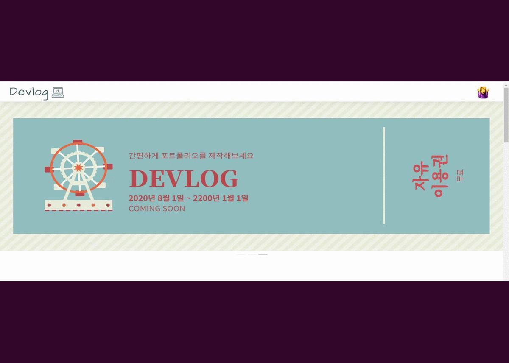
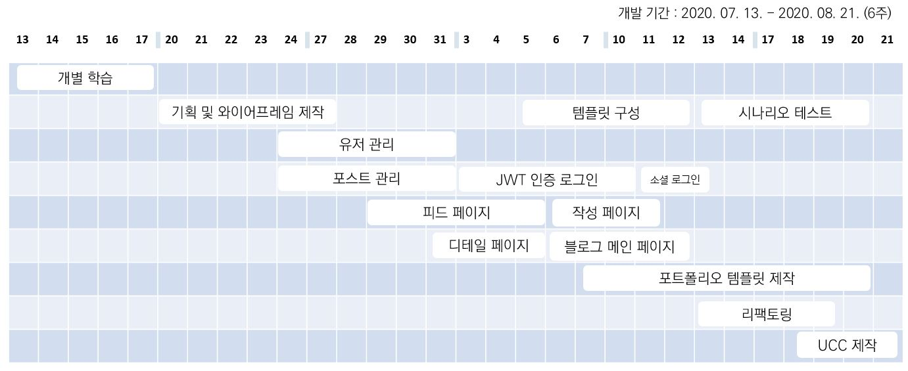


#   
 
   
   
  

> [Devlog](http://i3a402.p.ssafy.io/)  
> [Devlog API](http://i3a402.p.ssafy.io:8090/devlog/swagger-ui.html#)   
>   

SSAFY 3기 공통 프로젝트
 
## 개요
- 직관적이고 이용하기 쉬운 포트폴리오 제작 서비스를 제공하는 블로그 

## 기획 의도
- 개인 블로그에 진행했던 프로젝트 내역을 양식에 맞추어 업로드 해놓으면 추후 포트폴리오 생성시 
해당 프로젝트들을 불러와 시각화된 포트폴리오를 제공합니다.   
- 여러개의 템플릿 중 개인의 취향에 맞게 포트폴리오를 선택해 저장할 수 있습니다.
  
## 주요기능 및 스크린샷 

<h4>회원 관리</h4>

- 기본 회원가입 이외에 카카오 및 네이버 계정을 이용해 여러 서비스를 이용할 수 있습니다. 

<h4>TIL, 프로젝트 관리</h4>

- TIL, 프로젝트 작성 및 임시저장, 좋아요, 댓글, 예약 기능 등이 있습니다.  

<h4>SNS 블로그</h4>

- 블로그 구독 및 관심 태그 기반의 게시물을 조회 할 수 있습니다. 

<h4>포트폴리오 제작</h4>

- 기존에 작성했던 프로젝트를 선택하고 추가 정보를 입력하면 나만의 포트폴리오가 만들어집니다. 
- 여러가지 템플릿 중 마음에 드는 템플릿을 선택하여 자신의 개성을 표현해보세요. 
- PDF 저장 또는 링크를 공유하여 취업 시 간편하게 제출할 수 있습니다.
 

## 실행 방법

1. npm run install
2. npm install node-sass
3. npm install vue-avatar
4. npm run dev

## 기대 효과
<h4>개발자 취업 성공률 강화 </h4>

- 개발자들에게 취업시 이점이 되는 포트폴리오 제작 기능을 쉽고 빠르게 제공함으로써 
포트폴리오를 만드는데 필요한 시간을 단축시켜주고 취업률을 높여줄 수 있습니다.

<h4>개발 역량 향상</h4>

- 개발자로서 기록하고 싶은 정보를 다른 사람들과 지속적으로 공유하고 피드백을 통해 개발 역량을 강화시킬 수 있습니다.

## 개선 계획

- [TODO](https://docs.google.com/spreadsheets/d/1oepRaSxXjLjH7jysRXlJGQSCKlrDdntnmp4L84fDZiE/edit#gid=349343557)
를 참고해주세요

## 배포자 및 개발자의 연락처 정보
 김유창 (프론트, 팀장) (oyes9316@gmail.com) 
 김선민 (프론트, UCC) (tyhtm3@naver.com) 
 손명지 (프론트, 기획) (ji_exitosa@naver.com) 
 서주현 (백엔드, 프론트) (rat71400@gmail.com) 
 차윤석 (백엔드, 서버) (c9boom7@naver.com) 

## 개발 일정

## 실행 환경(권장)

- Windonws 10
- Chrome

## 개발 환경

npm 6.14.5  
@vue/cli 4.4.6  
bootstrap 3.3.7  
element-ui 2.0.2  
node-sass 4.14.1  
SpringBoot 2.3.1.RELEASE  
AWS EC2  
Nginx 1.14.0  
MariaDB 10.5.4  

## 저작권 및 사용권 정보

Copyright &copy; 2020. <strong>SSAFY 개발자 9조대</strong>. All rights reserved.