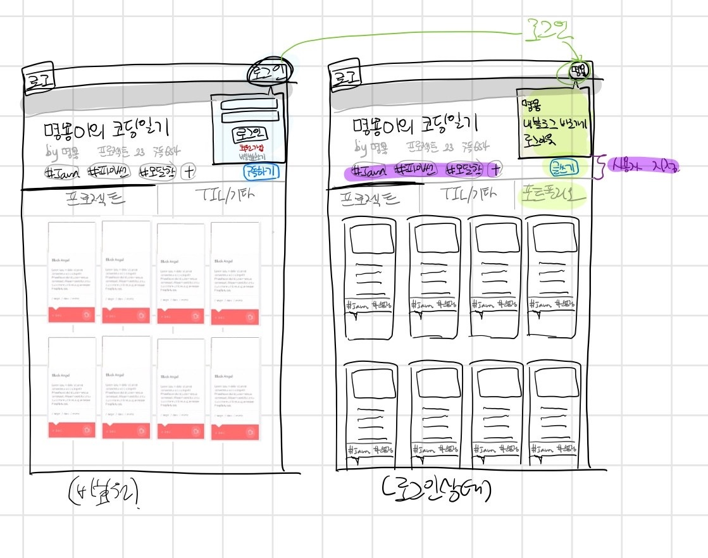
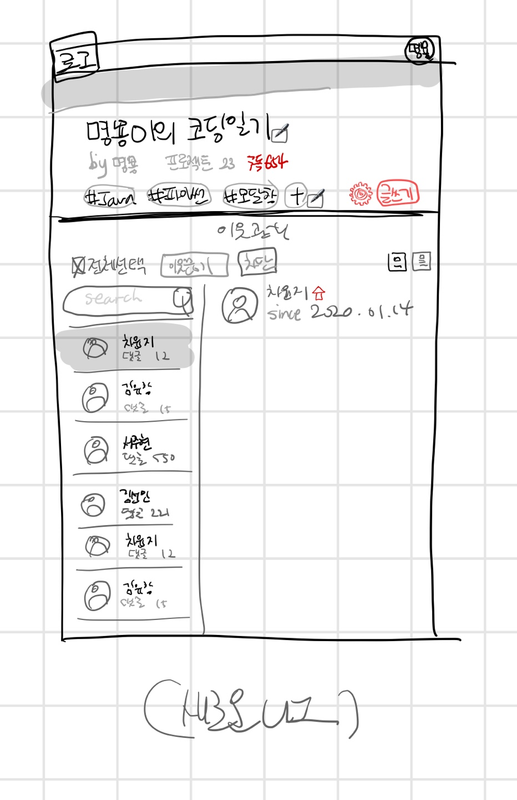

# Devlog 회의록

## 개요
- 일시: 2020. 07. 21. (화)
- 장소: 온라인
- 참석자: 김유창, 김선민, 서주현, 손명지, 차윤석

## 안건
- 주요 페이지 화면 구성, Git/ Jira 작성 형식

## 논의 내용
- 개인 블로그 메인 페이지 화면 구성을 어떻게 할지
- 포스트 작성 화면 페이지 화면 구성을 어떻게 할지
- Git commit 메시지 작성 형식
- Jira 이슈 등록 형식
- 프론트/백엔드 역할 분담
- 향후 일정
- 데이터베이스 설계(서주현, 차윤석)

## 결정 내용
- 개인 블로그 메인 페이지 와이어 프레임

- 포스트 작성 페이지

- 관리 페이지

 

- 이웃 관리 페이지

- Git commit 메시지 작성 방법
1. 메세지는 모두 영어로
2. 본문과 제목은 한줄 띄워서 분리 
3. 제목은 명령조를 사용
5. 참고1 - <https://blog.ull.im/engineering/2019/03/10/logs-on-git.html>
6. 참고2 - <https://meetup.toast.com/posts/106>

- Jira 이슈 등록 방법
1. 에픽 이슈로 기능 분류
2. Labels 및 이슈 제목으로 프론트/백엔드 분류

- DataBase구현(backend/src/DB/devlog.sql)