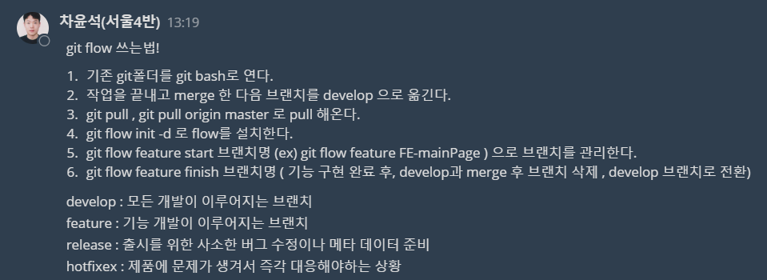
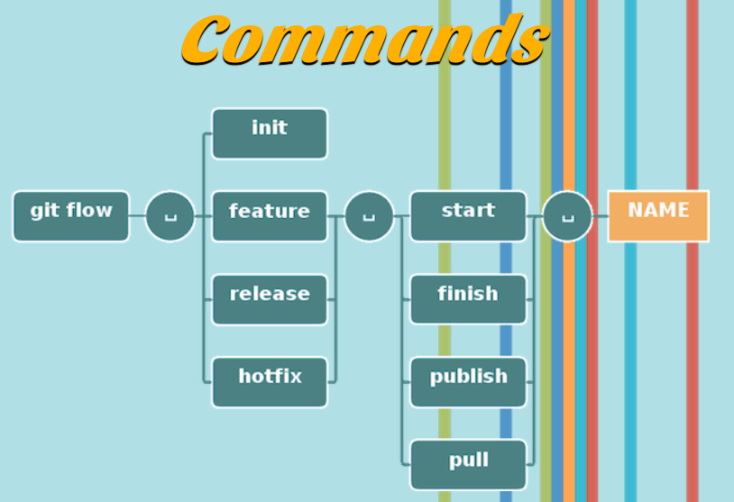
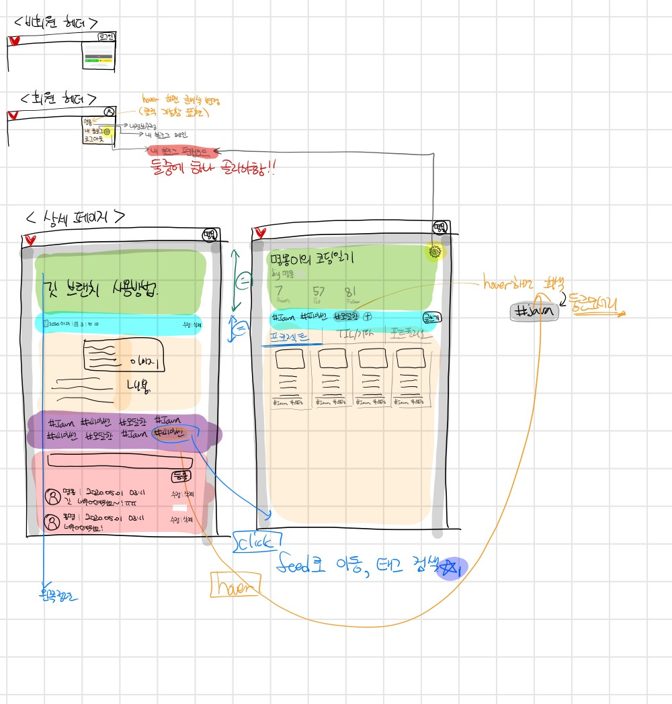

# Devlog 회의록

## 개요
- 일시: 2020. 07. 23. (목)
- 장소: 멀티캠퍼스
- 참석자: 김유창, 김선민, 서주현, 손명지, 차윤석

## 안건
- 브랜치 정리 및 형식 재논의, 주요 페이지들 화면 구성

## 논의 내용
- 브랜치 네이밍 형식 어떻게 통일 할지
- User 데이터베이스 컬럼 어떻게 할지
- 포스팅 상세 페이지 화면 구성(댓글, 좋아요 위치 등)
- 포스트 작성 페이지 화면 구성
- 프로젝트 작성 페이지 화면 구성과 입력 받을 항목들 
- 포트폴리오 입력 페이지와 상세 페이지 화면 구성
- 데이터베이스 설계
- 백엔드 역할 분담

## 결정 내용
- 현재 작업중인 브랜치는 모두 develop 브랜치로 merge하고 이후에 git flow를 이용하여 작업

- 포스트 디테일 페이지

- 포스트 작성 페이지
- 프로젝트 작성페이지
- 이후 브랜치 생성시 브랜치명 feature/단-기능 형식으로 작성 ex) feature/BE-blog
- 백엔드 역할 분담 - 회원관리,블로그  (차윤석) / 포스트 관리 (서주현)