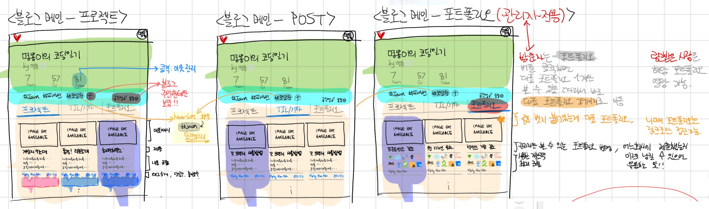

# Devlog 회의록

## 개요
- 일시: 2020. 07. 28. (화)
- 장소: 멀티캠퍼스
- 참석자: 김유창, 김선민, 서주현, 손명지, 차윤석

## 안건
- 블로그 페이지 리스트의 포스팅 ui, 추후 일정

## 논의 내용
- 블로그 메인 페이지의 포스팅 리스트의 카드 디자인
- 불필요한 브랜치 처리 방법
- 이번주에 해야할 일들

## 결정 내용
- 블로그 메인 페이지의 포스팅 리스트의 카드 디자인

- 머지가 끝난 브랜치들과 불필요하게 남아 있는 브랜치들 삭제 
- 해야 할 것들
1. ui가 결정된 것들 와이어프레임 작성
2. 포르폴리오 작성/디테일 페이지 화면 구성 정하기
3. 로고 정하기
