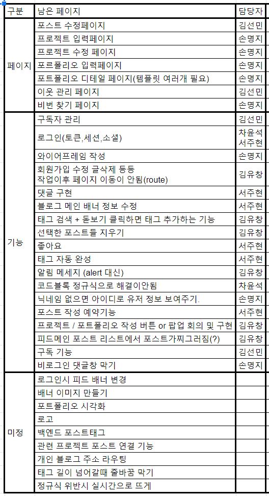

# Devlog 회의록

## 개요
- 일시: 2020. 08. 04. (화)
- 장소: 멀티캠퍼스
- 참석자: 김유창, 김선민, 서주현, 손명지, 차윤석

## 안건
- 미구현 페이지/기능 정리 및 역할 분배
- 포트폴리오 작성/디테일 페이지 화면 구성

## 논의 내용
- 미구현 페이지와 기능이 무엇인지
- 정리된 미구현 목록 기반으로 역할 분배
- 포트폴리오 작성 페이지와 디테일 페이지를 어떻게 구성할지

## 결정 내용
- 미구현 페이지 및 목록 구글 스트레드시트에 정리하고 역할 분배

- 포트폴리오 작성 페이지 와이어프레임

- 디테일페이지 와이어 프레임

