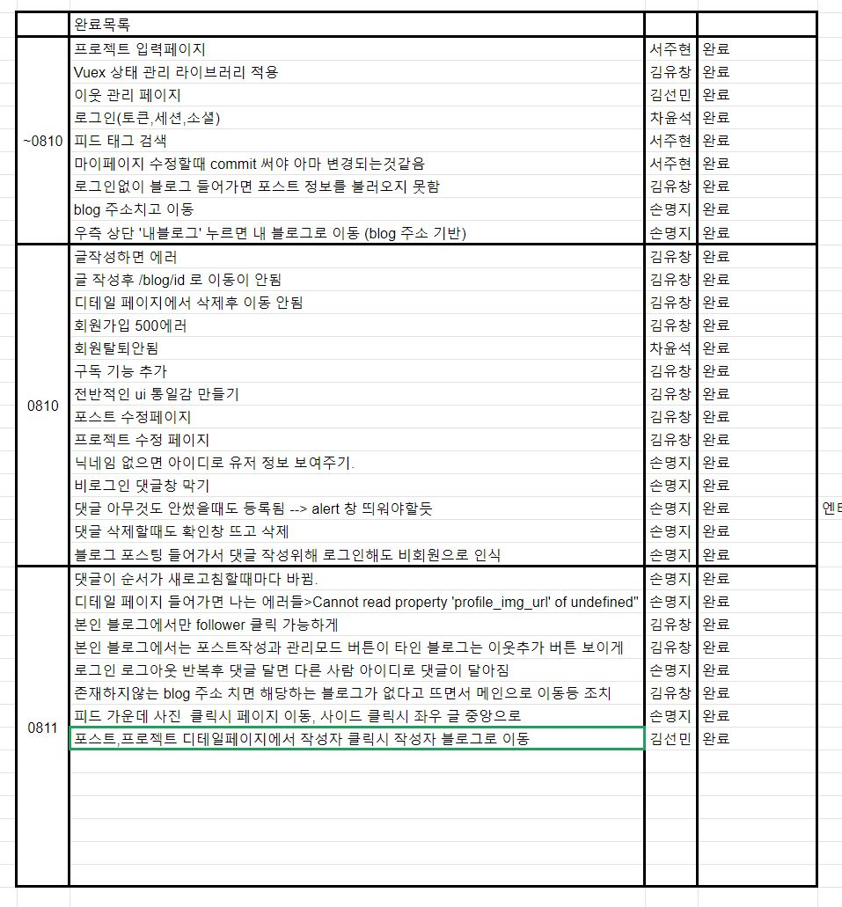
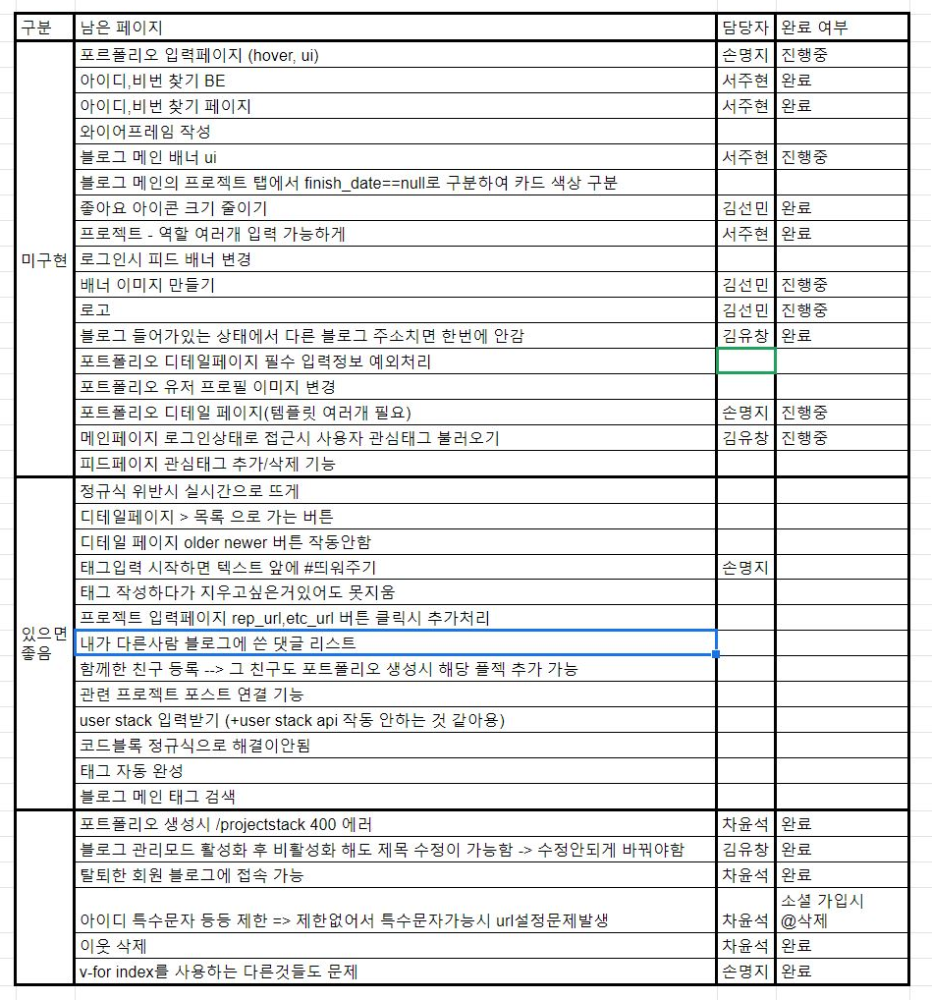

# Devlog 회의록

## 개요
- 일시: 2020. 08. 11. (화)
- 장소: 멀티캠퍼스
- 참석자: 김유창, 김선민, 서주현, 손명지, 차윤석

## 안건
- 기능 구현 목록 갱신 및 정리

## 논의 내용
- 기존 구현 리스트 중 완료된 것들 정리
- 새로 발견한 문제점이나 버그가 있는지 확인
- 남은 구현 리스트 순위를 고려해 재분류
- UCC 담당 정하기

## 결정 내용
- 기존 구현 리스트중 완료된 항목

- 리스트 갱신 후

- UCC 담당 : 김선민